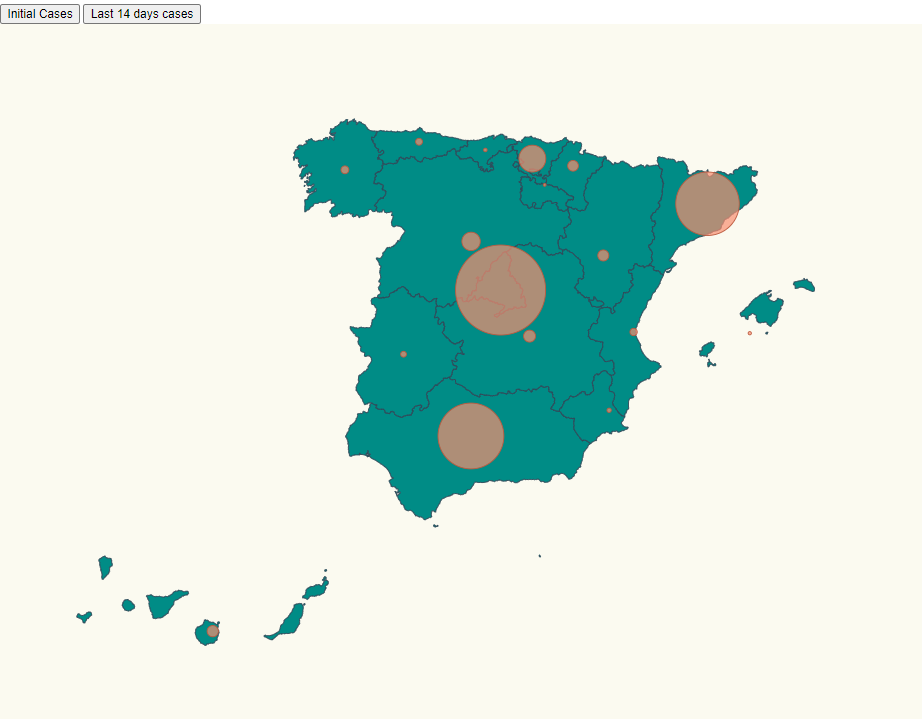

# Spain Covid-19: Task 1

This Task consists on a Spain's map where coronavirus' cases are represented in the different communities using circles. The bigger the circles are, more cases there are in each community. Two buttons have been added to the map, so we can see which communities were more affected in the beginning are in the lasts 14 days.




# Steps

```bash
npm install
```

- When you deal with maps you can use two map formats GeoJSON or TopoJSON, topo JSON is lightweight and offers some extra
  features, let's install the needed packages to work with:

```bash
npm install topojson-client --save
```

```bash
npm install @types/topojson-client --save-dev
```

- Let's install topojson:

```bash
npm install topojson --save
```

```bash
npm install @types/topojson --save-dev
```

- Let's install the _composite projections_ project to display the Canary Island just below spain.

```bash
npm install d3-composite-projections --save
```

- Let's import topojson, the json from Spain, the file that contains latitude and longitude  of the Spain's communities and the projections project that we use to place the Canary islands near the Peninsula ibérica. Also the covid stats must to be imported.

_./src/index.ts_
```typescript
import * as d3 from "d3";
import { interpolateMagma } from "d3";
import { on } from "node:events";
import * as topojson from "topojson-client";
const spainjson = require("./spain.json");
const d3Composite = require("d3-composite-projections");
import { latLongCommunities } from "./communities";

import { statsIni, statsLast, ResultEntry } from "./covid";
```
- This function give us the number of cases that the most affected community has.
```typescript
const maxAffected = (s: ResultEntry[]) => {
  const max = s.reduce((max, item) => (item.value > max ? item.value : max), 0);
  return max;
};
```

- This function is used to calculate the radius that every community must have. The most affected community is going to have the biggest circle, it should dicrease linearly for the other communities. It is very important to know that these radius are calculated in order to the data that is represented, NOT in order of all the data that we have, it means that similar radius between Initial cases and Last cases DOES NOT MEAN similar number of cases . I have done like this because the number of cases at the beginning were very small in comparison to the last number of cases, meaning that circles with data of the covid beginnings should be very small.

``` typescript
const calculateRadiusBasedOnAffectedCases = (
  comunidad: string,
  s: ResultEntry[]
) => {
  const entry = s.find((item) => item.name === comunidad);

  const affectedRadiusScale = d3
    .scaleLinear()
    .domain([0, maxAffected(s)])
    .range([0, 50]);

  return entry ? affectedRadiusScale(entry.value) : 0;
};
```
- Setting the spain projection, translation and scale.
```typescript
const aProjection = d3Composite
  .geoConicConformalSpain()
  .scale(3300)
  .translate([500, 400]);
const geoPath = d3.geoPath().projection(aProjection);

const geojson = topojson.feature(spainjson, spainjson.objects.ESP_adm1);
```
- Setting a background color and rendering map
```typescript
const svg = d3
  .select("body")
  .append("svg")
  .attr("width", 1024)
  .attr("height", 800)
  .attr("style", "background-color: #FBFAF0");

svg
  .selectAll("path")
  .data(geojson["features"])
  .enter()
  .append("path")
  .attr("class", "country")
  .attr("d", geoPath as any);

```

- Setting the initial state of the map with stats of the covid beginnings
```typescript
svg
  .selectAll("circle")
  .data(latLongCommunities)
  .enter()
  .append("circle")
  .attr("class", "affected-marker")
  .attr("r", (d) => calculateRadiusBasedOnAffectedCases(d.name, statsIni))
  .attr("cx", (d) => aProjection([d.long, d.lat])[0])
  .attr("cy", (d) => aProjection([d.long, d.lat])[1])
  ;
```
- Function for updating the circles radius when clicking a button.
```typescript
const updateRadius = (data: ResultEntry[]) => {
  d3.selectAll("circle")
    .data(latLongCommunities)
    .transition()
    .duration(500)
    .attr("class", "affected-marker")
    .attr("r", (d) => calculateRadiusBasedOnAffectedCases(d.name, data))
    .attr("cx", (d) => aProjection([d.long, d.lat])[0])
    .attr("cy", (d) => aProjection([d.long, d.lat])[1])
};
```
- Getting the id of the buttons and listening to an event, then update the radius depending of the button selected.
```typescript
document
  .getElementById("Inicio")
  .addEventListener("click", function handlResultsIni() {
    updateRadius(statsIni);
  });

document
  .getElementById("Final")
  .addEventListener("click", function handlResultsFinal() {
    updateRadius(statsLast);
  });
  ```
