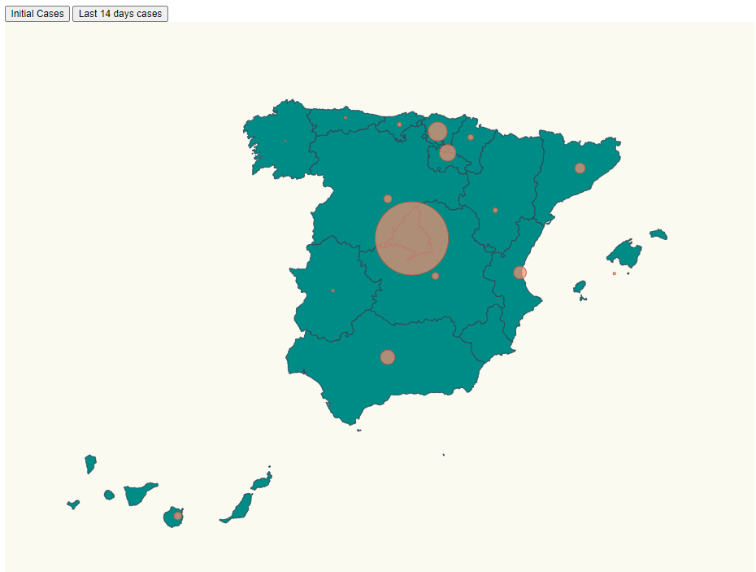

# Spain Covid-19: Task 1

This Task consists on a Spain's map where coronavirus' cases are represented in the different communities using circles. The bigger the circles are, more cases there are in each community. Two buttons have been added to the map, so we can see which communities were more affected in the beginning are in the lasts 14 days.




# Steps

- We will take as starting example _00-boilerplate_, let's copy the content from that folder and execute _npm install_.

```bash
npm install
```

- When you deal with maps you can use two map formats GeoJSON or TopoJSON, topo JSON is lightweight and offers some extra
  features, let's install the needed packages to work with:

```bash
npm install topojson-client --save
```

```bash
npm install @types/topojson-client --save-dev
```

- Let's install topojson:

```bash
npm install topojson --save
```

```bash
npm install @types/topojson --save-dev
```

- Let's install the _composite projections_ project to display the Canary Island just below spain.

```bash
npm install d3-composite-projections --save
```
